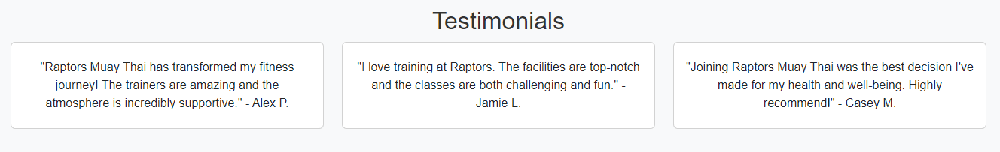
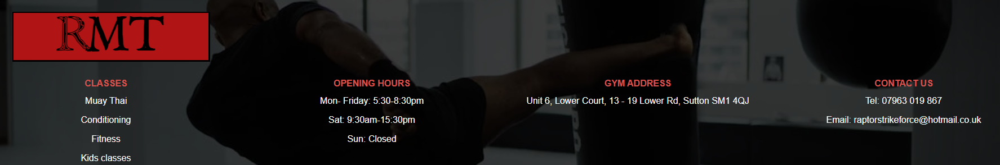
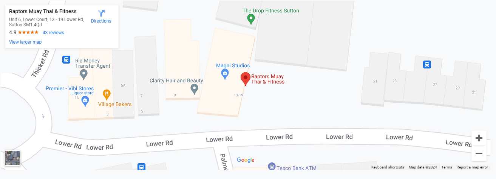
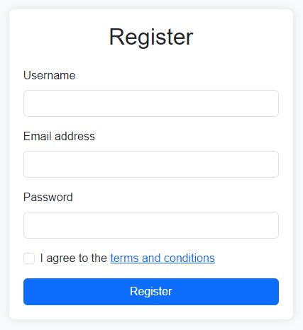

# Raptors Muay Thai
## A website built for a local Muay Thai gym in London, United Kingdom.
## - Ramil Jose Tyrone Tuazon

.PNG)

## [Live site](https://ramil96.github.io/raptors-muay-thai/)

## [Repository](https://github.com/Ramil96/raptors-muay-thai)

## Table of contents

1. [UX](#ux)
2. [Features](#features)
3. [Future features](#future-features)
4. [Technology used](#technology-used)
5. [Testing](#testing)
6. [Bugs](#bugs)
7. [Deployment](#deployment)
8. [Credits](#credits)
9. [Content](content)
10. [Acknowledgements](#acknowledgements)

## UX

### Pre-project planning
> When embarking on this project, I wanted to create a website that not only showcases the dynamic spirit of Raptors Muay Thai but also provides an accessible platform for new and existing members. I was driven by my passion for martial arts and my personal connection to Raptors Muay Thai. Having trained there for several years, I have seen firsthand the dedication and hard work of the trainers and athletes. 

I looked at the existing website of Raptors Muay Thai and started to decide wether there were any parts of the website which I wanted to keep. After spending some time analysing the website thoroughly I decided that I wanted to do a whole revamp of the site layout, carrying over very few elements such as the information regarding the classes, the logo and the timetable. I decided I wanted to enhance user experince and make it simple for potential customers to navigate through the site making it easier to join the gym. I wanted to change many elements from the old site especially contrast in colors so user readability is enhanced, pricing to be made much more clear with new content filled sections being added and higher quality images with a new modern feel to the site.

## UX Design

### Strategy Plane
---
To determine the best approach to this project, I began by identifying and understanding both user and business needs. By focusing on these needs, I could ensure that the website would be functional, user-friendly, and aligned with Raptors Muay Thai's goals.

## User Stories
### User
> As a user I want to be able to find a Muay Thai Gym in my local area to improve my fitness.

> As a user I want to be able to be able to see the prices of different memebership options.

> As a user I want to be able to read testimonials as proof of work and see evidence of the gym's training quality.

> As a user I want to be able to find out when the gym is open.

> As a user I want to be able to contact the gym online.

### Business Owner
> As the site owner I want to be able to showcase my Muay Thai gym to potential customers.

> As the site owner I want to share the history, community and background of our local gym.

> As the site owner I want to provide clear and detailed information about our class schedules, pricing, and membership options.

> As a site owner I want to show the user our gym’s opening hours and include a map for clear directions to the gym.

## Scope Plane
> The website should have a navigation menu that is consistent across all pages and devices.

> The website should neatly and appropriately list the services we provide, such as Muay Thai classes for adults and children, conditioning sessions, and fitness programs.

> The website should give users proof of our success through testimonials from members and a portfolio showcasing our training sessions, events, and achievements.

> The website should make it easy for prospective members to get in touch.

> The website should include a map so users can plan their route to our gym, making it easy to find us.

> The website should display our opening hours prominently on all pages, ensuring users are always aware of when they can visit or contact us.

## Structure Plane
> To achieve the goals of the above the website will inclide at least 4 pages consisting of: Home, About, Prices and Contact Us.

#### Home Page
> Navigation with links consistent across all pages.

> Hero image with text welcomes user with a consistent weekly schedule of activity letting the user know the gym is activley keeping information up to date.

> Testimonials on the Prices page showcasing reviews and experiences through members during time spent at the gym.

> Footer section containing the necessary information regarding classes taught, opening times, contact information and location, kept consistent across all pagess.

#### About Us
> The About Us page should show a picture of two Muay Thai fighters in a ring suggesting live gym competition.

> The Abous Us page should showcase information regarding the history of the gym itself and the variety of classes taught.

#### Prices
> The Prices page should show an image of a girl at the gym with a clickable button which takes the user to a specific part of the page which shows the different membership options giving the user the ability to choose from 3 unique memberships and has the ability to sign up and register via clicking the desired membership on this page.

#### Contact Us
> The Contact Us page should have a contact form where users can place there information in the form and write a message to the gym.

## Skeleton Plane

### Home Page desktop Wireframe

> The design flow of this website is meant to showcase a minimal design showing necessary information which is in the header.

## Surface Plane

### Color

> I decided that the best approach to this website was a structured yet minimalistic design to bring light to the most important information at the top by the header to influence direct access and information regarding location and contact information about the gym which would lead customers and website users to easilly access the website and information. To highlight this information and make the UX better I would need to stick to 3 main colors as the website prior to my creation had very hard to differentiate from background to information so instead of using dark colours I used bright colors which would contrast well with backgrounds I would be using.

> The decision I took in terms of which colors were to be used were
> - #A4161A - Blood red
> - #fff - White
> - #000 - Black

>Additional color usage was used at the bottom of the pages as the footer needed a stronger and brighter color to be able to see properly the sub headings for the items in the footer which are also clickable links so here i dimmed out the background and made the sub text even brighter for the user to see, additional color would come from images used across the website but the main color principle are the 3 most commonly used as suggested above.

### Typography 
> The font's chosen for this project were 
- Roboto
- Sans serrif

> The reason I used these two fonts were to keep the text simple and easy to read with no distractions. I wanted to make sure that I was able to assist users with visual impairments with the choice of font.

## Features

### index.html

#### Header Navigation Features

> Navigation Bar and header developed using bootstrap container fluid class. The header has many navigational features including the navigation bar. The logo brings access back to the home page on any page, the address is a clickable naviation and the social icons are displayed ontop for quick and easy access to social sites also the two buttons "get in touch" and "timetable" are working throughtout the entire site.

#### Call to action section

> Section inside of the home page has a call to action which when clicked will take the user to about.html.

#### Prices section 

> The design for this was recreated using the information on the timetable of the original site. I wanted to create 3 different membership options for users with the information gathered from the timetable as there was not an easily accessible location on the original website for users to select membership and access easily information regarding cost of membership and the different types offered by the gym.

#### Testimonials

> I wanted a straight to the point simple testimonials section that highlight easy to read access to member experience through testimonials which is located at the bottom of the prices page.

#### Footer 

> I wanted to create a footer with working clickable links to allow ease of access around the site. The raptors logo can be used as a means of returning to the top of the home page on any page. The "Classes" header in red will take you to a specific section of the about us page to read specifically about the classes taught at the gym. Clicking on the "Gym Address" will take you to a map where you can see the location of the gym on google maps. Clicking on "Contact Us" will take you directly to a form on the contact us page where you can engage with messaging the gym directly.

### about.html
#### About Us

> The about us page was initially intended to be a section for general muay thai information but after looking at the original website I saw that there was too much information regarding this so I made a touch of information about the sport on the home page and put more emphasis on the about us section to talk more about the history of the gym itself to draw a sense of comfotability and a sense of community to customers.

### prices.html
#### Prices

> I wanted to make this page subtle and not overwhelming for the user so the way I design this page is to start off with a call to action button and a subtle picture which uses suggestive techniques to prepare the user that they are approaching with caution and excitment as the picture in the background is of a girl on guard about to throw a kick. Once the button is clicked then the user will be taken to three membership options to chose from with working registration links. When scrolling further down the page the user will see the testimonials.

### contact-us.html
#### Contact Us

> I designed this page to be fairly minimalistic so that there would be numerous ways for users to find access to contacting the gym very easily, There are three places a user can caccess this information, through the header on every page, through the contact us page and through the footer. There is also the ability to enter your quiries directly to the gym through the form after clicking the contact us button.

### iframes map
#### Map

> I wanted to make sure that users were able to find access to the gym. With this desire I connected the iframes google maps option to the website making it easier for my website users to find the lcoation of them gym via access of the map which can be navigated to through clicking the location links in the header and footer or visiting the contact us page which also displays the map location of the gym.

### form.html
#### Form

> I wanted to make the user experience very simple so that there was no issues regarding UX. I wanted to make sure the customer had an easy and stress free experience when it came to registering on the website which is why I chose this simplistic minimalist style register form and designed it this way.

## Future Features

### Home page
> I would like to add a secondary hero image which switches between the two with different text overlay with the next image talking about future events with the gym such as future competitions and or additional information to boost website traffic by keeping it a place of up to date information.

### About Us page
> In the future I would like to icons and have a section with the facilities at the gym.

### Prices page
> In the future I would like to add a shop to give users the ability to purchase items on the store which is sold at the gym but will also be able to be sold on the website through this page.

### Contact Us 
> In the future I would like to add text on the first image of this page which talks about charities we may be working with in the future.

## Technology Used 

#### HTML
> I used HTML to structure my project.

#### CSS
> I used CSS to style my project and adjust the layout of certain elements on my website.

#### Font Awesome
> I used Font Awesome to add life and ease of readability for users.

#### GoogleFonts
> I used GoogleFonts to differentiate fonts from eachother to see what works best.

#### Googlemap iframes
> I used googlemap iframes to add a map to my website for users to access location and direction easier.

#### Bootstrap
> I used bootstrap to help with responsive elements throught my website improving user expereience on different devices.

## Testing
> Testing on this project was done manually by me by myself and some family members to determine the functionality of the site with both usability and responsiveness to make sure it is easily usable by a new user.

#### Testing links and form

| Test                                                         | Outcome |
|--------------------------------------------------------------|---------|
| All links on Navigation lead to their correct pages.         | Pass    |
| Logo on both header on footer when clicked lead to home page.| Pass    |
| Header social media links lead to the raptors social media.  | Pass    |
| All interactive header buttons and location links work.      | Pass    |
| User prevented from submitting form without correct elements.| Pass    |
| Success message when filling out both register and contact.  | Pass    |

#### Testing responsiveness

| Test                                                         | Outcome |
|--------------------------------------------------------------|---------|
| Home page, about, portfolio, contact us displays correctly on screens larger than 950px  | Pass    |
| Home page, about, portfolio, contact us displays correctly on screens smaller than 950px | Pass    |

### User testing
#### User testing challenge
> 5 users are given some basic tasks prior to visiting web page and the results totaled to give result (20% per successful user result.)

| Test                                                         | Outcome |
|--------------------------------------------------------------|---------|
| Upon arrival to website please navigate to where you would expect to find a contact form  | 100%    |
| Please navigate to the Facebook social of this business                                   | 100%    |
| Please fill in contact form with your information                                         | 100%    |
| Please fill in the register form on the pricing page via the signup button                | 100%    |
| Please navigate navigate through every page and click the timetable button                | 100%    |

#### User responsive testing
> 5 users were asked to view the website on their mobile devices and/or tablets to provide any feedback on errors or page overlapping issues.

| Test                                                         | Result |
|--------------------------------------------------------------|---------|
| Issues Reported         | None    |

## Google Lighthouse Testing 
### index.html

### about.html

### prices.html

### contact-us.html

## HTML Validation

### index.html

#### Result: No Errors

### about.html

#### Result: No Errors

### prices.html

#### Result: No Errors

### contact-us.html

#### Result: No Errors

## CSS Validation 

#### Result: No Errors

## Bugs

> Hero image text not responsive. Fixed - Added bootstrap sm -lg to resize ratio when scaled down in size using indentation to fix the element in desired place.

> Issues with navigation links on about us page. Fixed - Reconnected the href as when copying over the style from index to other pages the href and link was missing.

> Issues with contact us button only going to contact page and not selected div. Fixed - Re linked the href due to switching styles and information being deleted due to manual error.

> Navbar displaying white space on both sides and not filling the whole width of element. Fixed - Scaled full width of the color by using CSS 100% width to fill the whole navbar.

> Footer image showing on top of screen. Fixed - Adjusted the image using bootstrap comman image fluid and not fixed as fixed was pushing the footer image to the top of the page.

> About page location and prices header brings user to "no webpage found" error when clicking the location in header. Fixed

## Deployment
> To deploy the project I followed these steps from the main project repository [here](https://github.com/Ramil96/raptors-muay-thai)

1. Clicked on Settings on the navigation menu in the repository
2. I then selected the Pages menu on the side bar.
3. In the first dropdown menu labeled Source I selected the branch of the name main from the dropdown.
4. In the next dropdown labeled /root I left as the default option.
5. Selected Save

## Credits

### All images sourced are from pexels.com Links for images included  below

> hero image https://www.pexels.com/photo/man-and-woman-during-a-kickboxing-workout-8611942/

> about image https://www.pexels.com/photo/men-training-in-a-gym-5750838/

> about us image https://www.pexels.com/photo/two-contestant-doing-kick-boxing-match-598686/

> prices image https://www.pexels.com/photo/woman-in-black-dress-walking-down-the-stairs-4754138/

> contact us main image https://www.pexels.com/photo/strong-male-personal-trainer-showing-kickboxing-technique-to-young-woman-7991668/

> contact us secondary image https://www.pexels.com/photo/man-in-black-tank-top-and-brown-pants-doing-exercise-4761788/

> footer image https://www.pexels.com/photo/a-man-doing-kickboxing-4804068/

## Content and Resources 

### Maps
> Used to embed googlemaps iframe https://www.google.co.uk/maps

### Pexels.com
> Images used in this project.

### w3 schools
> Used for general help for HTML AND CSS syntax.

### bootstrap
> Used for help regarding the responsive side of development.

### stack overflow 
> For help with general quiries in regards to CSS and HTML

### Code Institute 
> Project created in line with course content and within project 1 scope.

## Acknowledgements 
### Alan Bushell
> My mentor who provided me with constructive feedback and positive reinforcement where applicable.